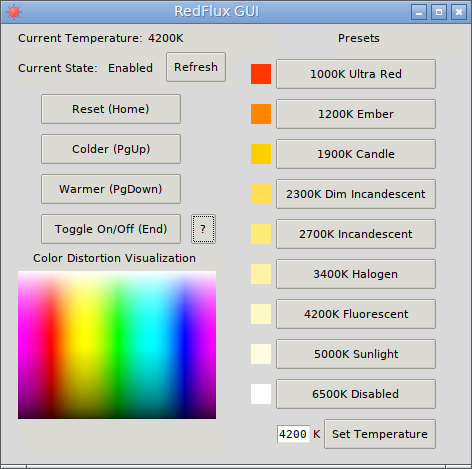

# RedFlux
CLI and GUI frontend for RedShift, inspired by f.lux.

Main priority is to give user full control on color temperature, not in the geographically automated way. This is for people like me that use blue light filter to reduce load on eyes whole day long, not just to fall asleep faster.

This repo consists of two scrpits:

* RedFlux (redflux) - CLI wrapper around RedShift, meant to be used by itself, ot with hotkey managers or in other scripts
* RedFlux GUI (redflux-gui) - GUI (Tk) wrapper around RedFlux, meant to be controlled by the user in graphical environment

## Dependencies

To use RedFlux CLI following things are required:

* RedShift
* Bash (*not just a POSIX shell*)

Optional dependencies (used only if component exists in system):

* libnotify (notify-send and some notification daemon)
* RedShift GUI

To use RedFlux GUI following things are required:

* RedFlux (**and its dependencies**)
* Tcl/Tk/wish (*available in repositories of most Linux distributions*)
* procps-ng/psmisc (*very common components, most probably already installed on your system*)
* tkbash (*bundled with RedFlux as redflux-tkbash in **3rd-party** folder*)

Optional dependencies (used only if component exists in system):

* yad (*for tray icon*)

## How to use

To be written... (Meanwhile you may look in source, it's quite simple)
